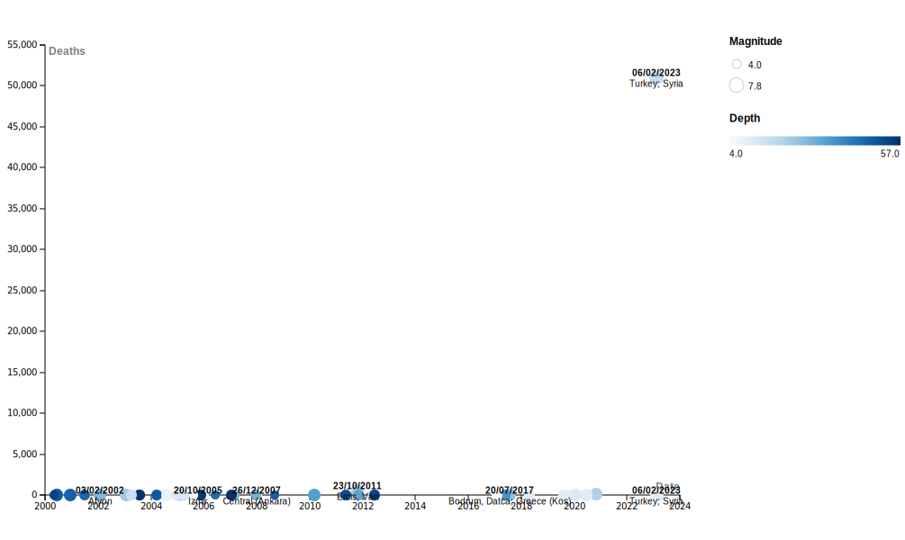
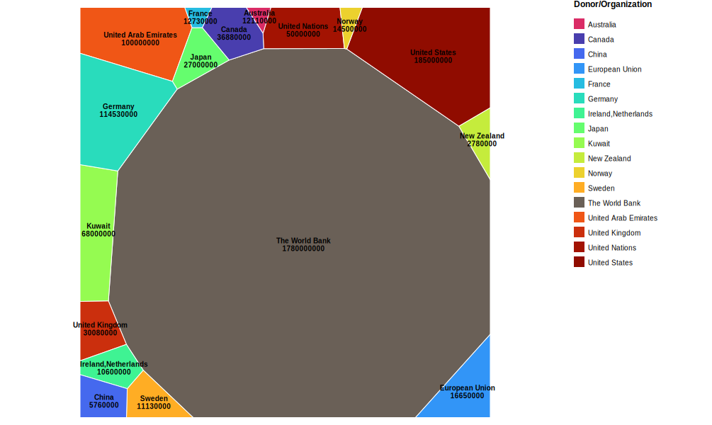
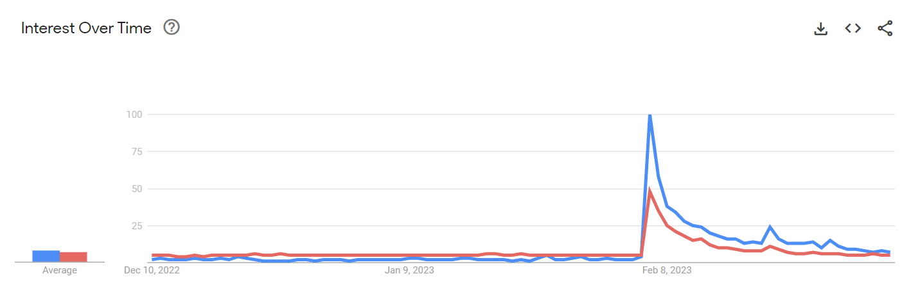
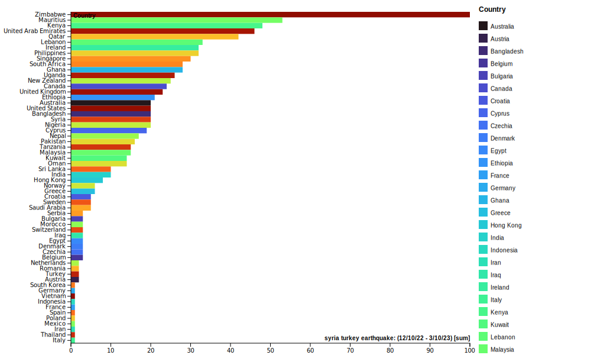

# Using-Online-Tools-to-Visualize-the-Turkey-Syria-Earthquake
# Abstract

The earthquake that struck Syria and Turkey was an unfortunately devastating event that left a mark in people's minds. But how can we see just how much attention this pulled towards the countries affected? By using tools like Google Trends and RAWGraphs, we can track the interest taken in these countries and how much effort was put into helping them.

# Introduction

On February 6th, 2023, just over a month prior to this writing, the largest earthquake in Turkey since 1939 struck Turkey and parts of Syria. The earthquake scaled a 7.8 magnitude,the largest earthquake in the area in decades. The damage caused by the earthquake was devastating, and by using tools like RAWGraphs and Google Trends, we can visualize and assess the data to know more about this event.

Powerful tools can give us insight as to how other parts of the world reacted to this event and whether there are any surprising numbers in the data. By collecting data from Google trends and websites providing numbers for the relief efforts concerning this earthquake, we can visualize just how much how countries reacted to such an event.

By using these tools, we can also see how other countries have reacted to the disaster in Turkey, by seeing how much search rates for Turkey increased after the event, as well as which countries provided support and how much. This gives more insight into which countries take interest in other countries that have been struck by a disaster.

# Methodology

1. Finding Data

This was an unprecedented earthquake that outclassed other earthquakes that have been in that area. To show this, raw data of earthquakes was compiled and used to create a graph to display the findings.

> A list of earthquakes and data about them was found in a table on a website called [WorldData.info](https://www.worlddata.info/asia/turkey/earthquakes.php)

To survey just how different countries provided relief for Turkey and Syria, data of money pledged was compiled and used to create a graph to display the findings.

The data found showed the dates, magnitude, depth, and casualties of earthquakes in and around Turkey and Syria dating all the way to 1950. For simplicity, the data was cut off from the year 2000 onward. This report will only be looking at earthquakes after that point.

> A list of countries and organizations pledging money for relief and data about them was found in a table on a website called [Devex.com](https://www.devex.com/news/funding-tracker-earthquake-relief-in-turkey-and-syria-104983)

The data found showed the countries and organizations involved in providing relief for Syria and Turkey, including funding for accomodation, food, health care, and water.

Then, Google trends was used to see the increase in searches for Turkey and earthquakes in the past 90 days. Search trends for both were compared to see if there was a correlation between the two searches. The search range was set to worldwide to see which regions searched for Turkey the most.

2. Creating the charts

After finding the table about the funding provided, that data was then taken and cleaned up in a csv file. This included converting the data from words to a numerical value. Then, the data was put into RAWGraphs to chart them. RAWGraphs took the data from the table and a voronoi treemap was chosen to represent this data. This chart was chosen to compare the amount of money each country listed has provided. The larger the portion a country has, the more money they've provided.

Similarly, the data for the earthquakes in that area were put through the same process, cleaned and put into RAWGraphs to chart the results. A bubble chart was chosen to compare the size and casualties caused by each earthquake as each earthquake can be represented on the chart with a bubble correlating with its size and casualty count.

For the search trends, the breakdown by regions for the search results of "syria turkey earthquake" was used to see which countries had the most interest in this topic. The data was taken, cleaned up, and sorted into a bar chart to compare them.

# Results

Here we have a visualization of the results from the table found on earthquakes in the area. The results of the data show a clear difference between this recent earthquake and the ones that came before it.

Even though there have been earthquakes since 2000 that have been as strong or large scale, the difference in casualties is night and day. There is not a single earthquake from this timeframe that comes close to even breaking a tenth of this one.

After taking the data into RAWGraphs, we have a visualization of the results from the table found and from Google Trends. The results of the data show which countries provided a large amount of funding to help Turkey and Syria recover.

Large countries and organizations, such as the United States and the World Bank provided the largest contributions to the relief fund, which is not surprising. The other big contributers are countries that are closer to Turkey and Syria, showing proximity to these disasters have an affect to the empathy shown.

Google trends shows that once it happened, the search terms "earthquake" and "Türkiye" both spiked to a degree.The blue line being interest in earthquakes, and red being for Turkey, this shows that people over the world quickly became interested in Turkey.

One thing to be noticed is that once it spikes to a high peak, the interest quickly dies down. Only a few small spikes follow before it reaches a low again.

The chart showing the search trends by region shows which countries have taken interest in Turkey and Syria since the disaster. Countries like Zimbabwe, Mauritius, and Kenya have high interest rates in the search term "Turkey-Syria earthquake".

This sparks discussion over why these countries in particular have such high search rates, and could be used in more research into the relationships these countries have with one another.

# Discussion

Data visualization tools like RAWGraphs and Google Trends are powerful applications to help understand and find out more from data. Seeing which countries provided the most relief funding is one thing, but seeing how much each country keeps a vested interest in these matters can lead to more observations and theories.

Tools like these are valuable as extensions to one's critical thinking abilities, as it can reveal trends that one may not see just from reading data from a table. Seeing the interest in Turkey spike and then almost as quickly die down can reveal a lot about human nature and lead to more questions that can be researched into.

In chapter 5 of *Debates in the Digital Humanities*, it speaks about digital artifacts being used like lens to interpret things in a different way. More ways to interpret data means that visualizations such as these are enhancing the methods in which people are using their skills to critically think about the world around them.

# Works Cited

Ainsworth, D., & Tamonan, M. A. (2023, March 6). Funding tracker: Earthquake relief in Turkey and Syria | devex. Devex. Retrieved April 18, 2023, from https://www.devex.com/news/funding-tracker-earthquake-relief-in-turkey-and-syria-104983 

National Geophysical Data Center / World Data Service (NGDC/WDS): NCEI/WDS Global Significant Earthquake Database. NOAA National Centers for Environmental Information. doi:10.7289/V5TD9V7K 2023-02-10

ISC (2022), ISC-GEM Global Instrumental Earthquake Catalogue (1904–2018), Version 9.1, International Seismological Centre, doi:10.31905/D808B825

